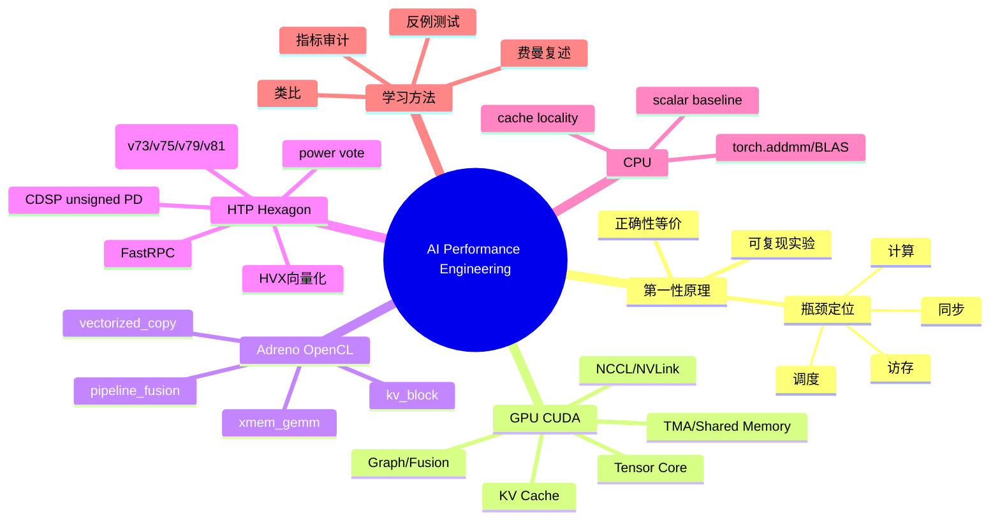

# 各章节 GPU / HTP / Adreno / CPU 优化知识地图与指标对照

> 生成日期：2026-07-03  
> 位置：`docs/chapter_backend_optimization_map.md`  
> 说明：GPU canonical 指标来自各章 `README.md` 的 canonical/representative measured delta；RTX 2060 GPU minimal、HTP、Adreno、CPU 指标来自标准 minimal runner。不同后端的 minimal workload 用来说明“同类优化思想如何落到不同硬件”，不是与原 GPU 章节目标逐项同 workload 对打。

## 关键词科普
- **第一性原理**：性能 = 有效工作量 /（计算瓶颈、访存瓶颈、同步瓶颈、调度瓶颈中最大的那个）。优化不是“换一个快 API”，而是先证明瓶颈在哪里。
- **Roofline**：把算力峰值和带宽峰值画成天花板；如果点贴着带宽线，继续换更强 ALU 没用，先减流量/提高复用。
- **Kernel fusion**：把多次读写全局内存和多次 launch 合成一次，核心收益通常是少搬数据、少调度。
- **Batching / Graph replay**：把很多小活攒成大活，减少每次提交的固定成本。
- **Locality / Cache / KV block**：让数据在离计算单元更近的位置被重复使用，少走慢路径。
- **Precision policy**：FP16/BF16/FP8/INT/量化不是“精度越低越好”，而是在误差预算内减少带宽、存储和计算成本。
- **HTP/HVX**：Qualcomm Hexagon Tensor Processor 的向量/矩阵侧，适合低功耗、固定形状、数据搬运可控的端侧工作。
- **Adreno/OpenCL**：移动 GPU 通用并行路径，适合吞吐型 shader/OpenCL kernel，但 dispatch、内存层级、驱动行为与 CUDA 不同。
- **CPU baseline**：最容易验证正确性和写清楚逻辑，但吞吐通常差；优化常来自 BLAS/向量化/缓存友好，而非手写三重循环。

## Mermaid 知识地图


## 一句话总览
- **GPU/CUDA**：最强吞吐和生态，适合大矩阵、训练、服务端推理；代价是功耗、部署复杂度和 profiler/驱动栈要求高。
- **Adreno/OpenCL**：移动 GPU 上用通用并行 kernel 表达同类思想；对 xmem GEMM、KV block 和 copy 场景收益明显，但 OpenCL 编译/驱动差异大。
- **HTP/Hexagon**：低功耗端侧 DSP/AI 加速路径；适合可批处理、可向量化、固定形状的数据流，FastRPC/skel 工程门槛更高。
- **CPU**：最佳可解释/可验证 baseline；用 BLAS/向量化可获得很大相对提升，但绝对吞吐和能效通常不是大模型热路径首选。

## 后端实现差异
| 后端 | 本工程实现 | 主要优化手段 | 最适合 | 常见失败模式 | 指标解读 |
| --- | --- | --- | --- | --- | --- |
| GPU/CUDA | 各章 `baseline_*` / `optimized_*`、CUDA/Triton/PyTorch | Tensor Core、shared memory、TMA、fusion、graphs、NCCL、KV cache | 大吞吐训练/推理、服务端 | launch 多、访存乱、同步多、shape 不合适 | 看 canonical README 指标，代表原章节主线 |
| GPU/CUDA minimal | `core/benchmark/gpu_minimal.py` + `chXX/compare_gpu_minimal.py`，`compare.py` 在 `sm_75` 及以下默认转入 | batched GEMM、PyTorch CUDA fusion、bulk copy、block KV | RTX 2060/Turing 等不能跑 Blackwell 专项代码的教学 GPU | 未锁频/非 canonical 环境、PyTorch 表达未必真融合 | 标准 2060 可运行入口，验证同类思想在 CUDA 老卡上可跑 |
| Adreno/OpenCL | `core/benchmark/adreno_minimal.py` + OpenCL C++ | xmem GEMM、float4 copy、kernel fusion、block KV | Android 移动 GPU | OpenCL 编译差异、workgroup 不匹配、带宽瓶颈 | 真机 minimal，可验证同类思想在 Adreno 上可跑 |
| HTP/Hexagon | `core/benchmark/htp_minimal.py` + FastRPC/IDL/skel | HVX vector add/copy、block KV、per-arch skel、power vote | 低功耗端侧固定流水 | FastRPC 固定成本、skel/签名/arch 不匹配、动态 shape 不友好 | 真机 minimal，验证 CDSP/HVX 路径和优化方向 |
| CPU | `core/benchmark/cpu_minimal.py` | scalar loop → `torch.addmm`/BLAS | 正确性锚点、小规模 fallback | 把 CPU speedup 误读成端侧/GPU speedup | 适合教学和验证，不代表大模型最终吞吐 |

## 代表场景默认规模指标
这些是默认参数的代表场景，不是低迭代 smoke；CPU 在 `/opt/perf` 环境，RTX 2060 GPU minimal 在远端 `ssh mi` 运行，HTP/Adreno 在连接设备上运行。

| 章节 | 后端 | 场景 | Baseline | Optimized | Speedup | Correctness |
| --- | --- | --- | ---: | ---: | ---: | --- |
| CH02 | CPU | scalar_loop→addmm | 1.189 ms | 0.005 ms | 247.95x | 0/torch validate |
| CH02 | HTP | hvx_tile | 12.236673 ms | 2.760814 ms | 4.43x | 0 |
| CH02 | Adreno | xmem_gemm | 3.932382 ms | 0.487413 ms | 8.07x | 0.00009872 |
| CH05 | CPU | scalar_loop→addmm | 1.197 ms | 0.006 ms | 193.05x | 0/torch validate |
| CH05 | HTP | copy_vectorized | 18.785638 ms | 2.942982 ms | 6.38x | 0 |
| CH05 | Adreno | copy_vectorized | 1.494224 ms | 0.735870 ms | 2.03x | 0.00000000 |
| CH13 | CPU | scalar_loop→addmm | 1.165 ms | 0.005 ms | 245.14x | 0/torch validate |
| CH13 | HTP | kv_block | 7.066497 ms | 2.266569 ms | 3.12x | 0 |
| CH13 | Adreno | kv_block | 4.272861 ms | 0.131790 ms | 32.42x | 0.00000000 |
| CH20 | CPU | scalar_loop→addmm | 1.176 ms | 0.005 ms | 230.04x | 0/torch validate |
| CH20 | HTP | pipeline_fusion | 16.033971 ms | 2.568398 ms | 6.24x | 0 |
| CH20 | Adreno | pipeline_fusion | 0.407622 ms | 0.255790 ms | 1.59x | 0.00000000 |

## 远端 RTX 2060 GPU minimal 实测
按用户给出的远端流程运行：`ssh mi && cd /opt/prj/ai-performance-engineering/code && source /opt/perf/bin/activate`。远端 GPU 为 `NVIDIA GeForce RTX 2060`，`torch 2.12.1+cu129`。这些数据来自标准 `core/benchmark/gpu_minimal.py` / `chXX/compare_gpu_minimal.py` PyTorch CUDA minimal 微基准，未锁频，属于非 canonical/教学对照数据；canonical GPU 指标仍以各章 README 表为准。

| GPU minimal 场景 | 类比优化项 | Baseline | Optimized | Speedup | Max Error |
| --- | --- | ---: | ---: | ---: | ---: |
| `torch_gemm` | looped small GEMMs → single batched matmul | 2.036330 ms | 0.029781 ms | 68.38x | 0 |
| `pipeline_fusion` | three separate tensor ops → one vectorized expression | 0.098804 ms | 0.100959 ms | 0.98x | 0 |
| `copy_vectorized` | chunked copy loop → single bulk device copy | 10.845355 ms | 0.120022 ms | 90.36x | 0 |
| `kv_block` | per-token KV row update → block vectorized update | 1.240781 ms | 0.028814 ms | 43.06x | 0 |

| 章节 | GPU minimal 场景 | Remote RTX 2060 speedup |
| --- | --- | ---: |
| CH01 | `torch_gemm` | 68.38x |
| CH02 | `torch_gemm` | 67.12x |
| CH03 | `torch_gemm` | 67.23x |
| CH04 | `pipeline_fusion` | 0.98x |
| CH05 | `copy_vectorized` | 90.36x |
| CH06 | `pipeline_fusion` | 1.01x |
| CH07 | `copy_vectorized` | 87.84x |
| CH08 | `pipeline_fusion` | 1.02x |
| CH09 | `pipeline_fusion` | 0.98x |
| CH10 | `torch_gemm` | 69.26x |
| CH11 | `kv_block` | 43.06x |
| CH12 | `kv_block` | 41.60x |
| CH13 | `kv_block` | 37.12x |
| CH14 | `torch_gemm` | 68.86x |
| CH15 | `kv_block` | 41.86x |
| CH16 | `torch_gemm` | 68.62x |
| CH17 | `kv_block` | 42.28x |
| CH18 | `kv_block` | 41.10x |
| CH19 | `copy_vectorized` | 89.42x |
| CH20 | `pipeline_fusion` | 1.03x |

## 全章节优化点与后端 minimal 指标
- **GPU canonical 列**：来自各章 README 的原始章节优化主线。
- **HTP/Adreno/CPU 列**：本次 minimal runner 的全章节 smoke 指标，统一低迭代参数用于覆盖入口和正确性，不用于发布级性能结论。

| 章节 | 原章节优化点 | GPU canonical 指标 | HTP minimal | Adreno minimal | CPU minimal |
| --- | --- | --- | --- | --- | --- |
| CH01 | FP16 and fused microbatch execution for the training loop; separate precision-only and fusion-only variants so the training-loop story is decomposable | gemm: 29.51x<br>performance: 4.82x<br>nvfp4_mlp: 0.97x | hvx_tile / 1.13x | xmem_gemm / 3.61x | CPU scalar→addmm / 41128.39x |
| CH02 | topology-aware transfer and coherency choices; tuned cuBLAS invocation parameters | grace_coherent_memory: 23.14x<br>memory_transfer: 5.20x<br>cublas: 5.17x | hvx_tile / 1.15x | xmem_gemm / 3.03x | CPU scalar→addmm / 230.55x |
| CH03 | NUMA pinning and topology-aware process placement; container and cluster settings that stop starving the GPU | pinned_prefetch_mlp: 3.64x<br>gemm: 2.90x<br>double_buffered_batch_provisioning: 1.61x | hvx_tile / 1.09x | xmem_gemm / 3.18x | CPU scalar→addmm / 246.06x |
| CH04 | explicit overlap between compute and communication; fusion and pre-staging to reduce collective overhead | gradient_fusion: 68.83x<br>dataparallel: 7.86x<br>grace_blackwell_locality: 16.01x<br>bandwidth_benchmark_suite: 1.75x | pipeline_fusion / 1.05x | pipeline_fusion / 1.34x | CPU scalar→addmm / 244.80x |
| CH05 | vectorized preprocessing and overlap between IO and compute; tuned worker/prefetch settings | vectorization: 72.64x<br>storage_cpu: 2.07x | copy_vectorized / 1.05x | copy_vectorized / 2.03x | CPU scalar→addmm / 240.46x |
| CH06 | vectorized and parallelized kernels; ILP- and launch-bound-aware variants | add: 3881.04x<br>attention_ilp: 265.82x<br>autotuning: 3.92x | pipeline_fusion / 1.15x | pipeline_fusion / 1.37x | CPU scalar→addmm / 254.84x |
| CH07 | coalesced/vectorized copy paths; shared-memory tiling and TMA-backed staging where it helps | tma_bulk_tensor_2d: 3.44x<br>lookup: 45.41x<br>matmul: 3.18x | copy_vectorized / 1.32x | copy_vectorized / 1.85x | CPU scalar→addmm / 248.70x |
| CH08 | occupancy-aware launch and block-shape tuning; predication and loop-unrolling changes that expose more useful work per warp | threshold: 10.19x<br>loop_unrolling: 4.17x<br>ai_optimization: 2.68x | pipeline_fusion / 1.19x | pipeline_fusion / 1.49x | CPU scalar→addmm / 241.73x |
| CH09 | CUTLASS/Triton/custom-kernel paths with better tiling and reuse; fused or higher-intensity schedules that reduce redundant memory work | cutlass_gemm: 3.95x<br>memory_bound: 17.05x<br>sdpa_attention: 1.71x | pipeline_fusion / 1.22x | pipeline_fusion / 1.29x | CPU scalar→addmm / 238.92x |
| CH10 | warp-specialized and persistent kernels that keep producer/consumer work separated; TMA-fed pipelines that reduce staging overhead | cluster_group_single_cta: 71.42x<br>batch: 54.44x | hvx_tile / 1.13x | xmem_gemm / 3.35x | CPU scalar→addmm / 248.80x |
| CH11 | stream overlap where work is truly independent; stream-ordered cache and KV update paths that preserve correctness without full serialization | streams: 1.86x<br>stream_ordered_kv_cache: 1.50x<br>warp_specialization_multistream: 1.67x | kv_block / 1.21x | kv_block / 8.75x | CPU scalar→addmm / 244.87x |
| CH12 | CUDA Graph replay where the steady-state workload is stable enough; fused or GPU-resident queueing/dispatch where it actually removes launch overhead | cuda_graphs: 4.21x<br>kernel_fusion: 2.72x<br>work_queue: 4.75x | kv_block / 1.27x | kv_block / 11.13x | CPU scalar→addmm / 243.44x |
| CH13 | compiled, quantized, or allocator-aware PyTorch paths where they produce a real measured benefit; lower-overhead cache and attention paths | kv_cache_naive: 68.98% less memory<br>memory_profiling: memory-goal benchmark<br>autograd_standard: 8.04x<br>precisionfp8_te: 5.17x | kv_block / 1.58x | kv_block / 17.53x | CPU scalar→addmm / 209.71x |
| CH14 | `torch.compile` and regional compilation where the graph is stable enough to pay back compile cost; Triton persistent kernels and TMA-fed schedules where memory movement dominates | model_compile_reduced_precision: 3.74x<br>regional_triton: 2.25x<br>triton_persistent: 9.68x | hvx_tile / 1.12x | xmem_gemm / 3.20x | CPU scalar→addmm / 251.08x |
| CH15 | disaggregated prefill/decode and batched scheduling where they help; NVLink-pooled KV-cache strategies and topology-aware routing | continuous_batching: 4.16x<br>kv_cache_nvlink_pool: 6.11x<br>guided_decoding: 5.96x<br>greedy_sampler: 3.55x | kv_block / 1.34x | kv_block / 11.40x | CPU scalar→addmm / 240.25x |
| CH16 | Flash SDP, block-sparse attention, and scheduler-aware execution where they help; selective graph/compilation techniques for steady-state serving paths | flash_sdp: 1.63x<br>flashinfer_block_sparse: 3.94x<br>runtime_scheduler: 1.78x | hvx_tile / 1.27x | xmem_gemm / 3.24x | CPU scalar→addmm / 249.91x |
| CH17 | topology-aware or telemetry-aware routing decisions; disaggregated prefill/decode paths that reduce idle time and handoff overhead | routing_static: 7.07x<br>moe_router_uniform: 5.07x<br>prefill_decode_disagg_ttft: 2.85x | kv_block / 1.37x | kv_block / 17.01x | CPU scalar→addmm / 250.98x |
| CH18 | FlexDecoding, tensor-core-specialized kernels, and cache-aware paths; graph replay and serving-integrated decode paths where they help | flexdecoding: 1.97x<br>eos_early_exit: 4.71x<br>tensor_cores: 15.65x<br>rope_q_cache: 23.53x | kv_block / 1.12x | kv_block / 16.84x | CPU scalar→addmm / 246.03x |
| CH19 | quantized caches, lower-precision training/inference paths, and explicit buffering improvements; adaptive allocator or overlap logic where memory behavior is the actual bottleneck | dynamic_quantized_cache: 1.13x<br>memory_double_buffering: 1.97x<br>mxfp8_moe: 7.71x | copy_vectorized / 1.05x | copy_vectorized / 1.76x | CPU scalar→addmm / 240.87x |
| CH20 | staged pipeline, memory, and KV-cache optimizations combined into one workload; the same harness contract as every other chapter, so the end-to-end gains stay comparable to the lower-level chapters | integrated_kv_cache: 7.07x<br>bf16_mlp: 2.63x | pipeline_fusion / 1.18x | pipeline_fusion / 1.63x | CPU scalar→addmm / 239.64x |

## 全章节 minimal speedup 快表
| 章节 | CPU scalar→addmm | RTX 2060 GPU minimal | HTP smoke | Adreno smoke |
| --- | ---: | ---: | ---: | ---: |
| CH01 | 41128.39x | 68.38x | 1.13x | 3.61x |
| CH02 | 230.55x | 67.12x | 1.15x | 3.03x |
| CH03 | 246.06x | 67.23x | 1.09x | 3.18x |
| CH04 | 244.80x | 0.98x | 1.05x | 1.34x |
| CH05 | 240.46x | 90.36x | 1.05x | 2.03x |
| CH06 | 254.84x | 1.01x | 1.15x | 1.37x |
| CH07 | 248.70x | 87.84x | 1.32x | 1.85x |
| CH08 | 241.73x | 1.02x | 1.19x | 1.49x |
| CH09 | 238.92x | 0.98x | 1.22x | 1.29x |
| CH10 | 248.80x | 69.26x | 1.13x | 3.35x |
| CH11 | 244.87x | 43.06x | 1.21x | 8.75x |
| CH12 | 243.44x | 41.60x | 1.27x | 11.13x |
| CH13 | 209.71x | 37.12x | 1.58x | 17.53x |
| CH14 | 251.08x | 68.86x | 1.12x | 3.20x |
| CH15 | 240.25x | 41.86x | 1.34x | 11.40x |
| CH16 | 249.91x | 68.62x | 1.27x | 3.24x |
| CH17 | 250.98x | 42.28x | 1.37x | 17.01x |
| CH18 | 246.03x | 41.10x | 1.12x | 16.84x |
| CH19 | 240.87x | 89.42x | 1.05x | 1.76x |
| CH20 | 239.64x | 1.03x | 1.18x | 1.63x |

## 解决痛点
| 痛点 | GPU 解法 | Adreno 解法 | HTP 解法 | CPU 解法 |
| --- | --- | --- | --- | --- |
| Launch/提交固定成本高 | CUDA Graph、fusion、batching | 合并 OpenCL kernel、减少 enqueue | 一次 FastRPC 内部做 repeats/block | 交给 BLAS 批量算 |
| 带宽吃满但算力闲置 | tile、shared memory、TMA、量化 | xmem/local memory、vectorized copy | HVX 128B 向量 load/store | cache-friendly layout |
| KV cache 读写碎片化 | paged/block KV、active window | block KV kernel | block KV row update | 简化 reference 验证 |
| 主机/设备协同差 | streams、NCCL、NVLink topology | adb/OpenCL 设备路径显式化 | CDSP skel + power vote + unsigned PD | 单进程可复现 baseline |
| 低精度不安全 | tolerance、FP8/BF16 policy | OpenCL 输出误差检查 | checksum/max-error | torch reference 校验 |

## 容易误解处
1. **“Speedup 越大越高级”**：CPU scalar→BLAS 的 200x+ 很常见，因为 baseline 很弱；它不等于 CPU 适合大模型热路径。
2. **“HTP 一定比 Adreno 快”**：HTP 更偏低功耗和固定数据流；Adreno 在吞吐型 OpenCL kernel 上可能更快。
3. **“GPU canonical 与 minimal 可直接横比”**：不能。GPU canonical 是章节原 workload；HTP/Adreno/CPU minimal 是同思想移植样例。
4. **“低精度只影响算力”**：低精度常常真正省的是内存带宽、cache footprint、通信量。
5. **“fusion 总是更快”**：fusion 可能增加寄存器压力、降低 occupancy、破坏 cache reuse；要测。
6. **“端侧后端只是换编译器”**：HTP/Adreno 的 runtime、内存模型、调度粒度、库路径和签名/权限都是性能与可运行性的组成部分。

## 代价与局限
- **GPU/CUDA**：生态最强，但对硬件、driver、profiling、时钟锁定、shape 稳定性要求高；错误 fallback 会污染结论。
- **Adreno/OpenCL**：跨机型差异明显；kernel 编译和 OpenCL runtime 报错常比 CUDA 难诊断；xmem/local memory 调参依赖具体 GPU。
- **HTP/Hexagon**：FastRPC/skel 构建链复杂；需要匹配 `v73/v75/v79/v81` 等架构；小 workload 容易被 RPC 固定成本淹没。
- **CPU**：解释性最好，但高吞吐/能效差；适合 reference、fallback、小 batch，不适合把大模型热循环长期放 CPU 上。
- **本报告指标局限**：minimal 指标用于教学和入口验证；发布级结论还需要固定 clocks、多轮 AB、温度/功耗、profile artifact 和 shape coverage。

## 费曼学习法解析
> 如果要向新人解释：把一个模型推理流水线想成“厨房出餐”。

- **CPU scalar baseline**：一个厨师按菜单逐项手算，最清楚但最慢。
- **CPU BLAS**：把切菜交给标准化切菜机，还是在厨房内，但批量化了。
- **GPU/CUDA**：开中央厨房，一次处理很多盘菜；关键是别让传菜/排队/洗锅比做菜更慢。
- **Adreno/OpenCL**：手机里的小中央厨房，能批量炒，但锅、火、通道和服务端大厨房不一样。
- **HTP/Hexagon**：低功耗专用流水线，适合固定步骤的盒饭线；临时改菜单和频繁跨厨房沟通会拖慢。

用费曼法检查自己是否懂：你能不能不用“Tensor Core、HVX、xmem”这些词，解释为什么“把 100 次小提交合成 1 次大提交”通常会变快？答案应该落到固定成本、数据复用、排队和带宽上。

## 第一性原理推导
1. 先定义等价工作量：同 shape、同输入分布、同输出容差。
2. 把总时间拆成：`T = T_launch + T_transfer + max(T_compute, T_memory) + T_sync + T_runtime_overhead`。
3. 如果 `T_launch` 大：batch/graph/fusion。
4. 如果 `T_memory` 大：tiling/cache/local memory/quantization/layout。
5. 如果 `T_compute` 大：Tensor Core/HMX/HVX/低精度/更好算法。
6. 如果 `T_sync` 大：overlap、streams、pipeline、分布式拓扑。
7. 如果优化后 correctness 或 provenance 不清楚：速度数字先不可信。

## 顶尖从业者的共通底层思路
1. **先证明瓶颈，再写优化**：他们不会靠“这个 API 应该快”做决策。
2. **用反事实实验隔离变量**：precision-only、fusion-only、batching-only 分开测。
3. **把固定成本和边际成本分开**：一次 launch/FastRPC/enqueue 的固定成本，与每个元素的计算成本不是一回事。
4. **硬件模型先行**：知道 SM/HVX lane/local memory/cache/fabric 的约束，再设计 kernel。
5. **正确性是性能的一部分**：误差预算、checksum、reference path、fallback 标记必须和指标一起出现。
6. **偏爱可复现证据**：命令、环境、版本、artifact、profile 比口头经验更重要。
7. **不迷信单点 winner**：shape、batch、温度、driver、输入分布一变，winner 可能变。

## 内行最大分歧与双方证据
| 分歧 | A 方观点 | A 方证据 | B 方观点 | B 方证据 | 实务判断 |
| --- | --- | --- | --- | --- | --- |
| 手写 kernel vs 编译器/库 | 热路径必须手写，才能吃满硬件 | Triton/CUDA 专用 kernel 在稳定 shape 上常胜 | 先用 cuBLAS/SDPA/compile，维护成本低 | 库在广泛 shape 上鲁棒，升级自动获益 | 稳定且高价值 shape 手写；长尾 shape 用库/编译器 |
| GPU vs HTP/Adreno 端侧 | GPU/Adreno 吞吐更强、更通用 | OpenCL xmem/KV block 代表指标很高 | HTP 能效更优，适合固定低功耗 pipeline | HVX/default 场景在 copy/fusion 有稳定收益 | 端侧按功耗、延迟、shape 稳定性分流 |
| 低精度是否优先 | 低精度是最大杠杆 | FP8/BF16/MXFP8 多章有显著收益 | 低精度先带来验证和数值风险 | 某些 memory/launch 瓶颈下降精度收益有限 | 先定误差预算，再看瓶颈是不是 compute/bandwidth |
| fusion 是否越多越好 | fusion 减少 launch 和 DRAM 往返 | ch12/ch20 组合优化明显 | 过度 fusion 增加寄存器压力、降低 occupancy | profiler 里常见 occupancy/Spill 反噬 | fusion 到瓶颈转移为止，不追求“全合一” |
| benchmark 用 micro 还是 end-to-end | micro 才能定位机制 | 单 kernel 指标能解释原因 | end-to-end 才代表用户体验 | ch20 说明组合后才知道优化是否相互抵消 | 两者都要：micro 找因，E2E 定案 |

## 区分“吃透”与“死记”的测试题
### 题目
1. 一个 kernel 的 FLOP/s 只有峰值 10%，但内存带宽接近峰值 90%。你会先改算法、换低精度，还是改内存访问？为什么？
2. HTP minimal 在小 `elements` 上 speedup 接近 1，但默认规模有 6x。请用固定成本/边际成本解释。
3. Adreno `kv_block` speedup 很高，能否直接说它比 HTP 更适合所有 KV cache？列出至少三个必须补测的变量。
4. CPU scalar→BLAS 有 200x，为什么这不能证明 CPU 是最佳推理后端？
5. 给你一个 ch12 CUDA Graph 优化，如何设计实验区分“graph replay 减 launch”与“kernel 本身变快”？
6. 如果 fusion 后 latency 降低但 memory peak 增加，你怎么判断是否值得？
7. 为什么 README 的 GPU canonical 指标不能和 HTP minimal 逐项横比？怎样设计公平横比？
8. 端侧 HTP skel 需要按 `v81` 架构加载。如果设备报告 `v79`，但只推了 `v81` skel，会发生什么？怎么让失败显式可诊断？
9. 一个低精度优化速度不变但显存降 40%，这算成功吗？需要看哪些业务指标？
10. 你看到 profiler 显示 Tensor Core 利用率高，但端到端吞吐没变。列出三个非计算瓶颈解释。
11. 如何用一次 ABAB 实验证明某个优化不是温度/缓存/随机波动造成的？
12. 让你把 ch13 paged KV cache 移植到 HTP，你会先实现哪些最小验证，再谈性能？

### 判分标准
- **死记型答案**：只说“用 Tensor Core”“fusion 更快”“HTP 低功耗”，没有约束条件和验证方法。
- **吃透型答案**：能拆 `T_launch/T_memory/T_compute/T_sync`，能说清 workload 等价性、误差预算、shape 依赖和反例。
- **专家型答案**：会主动提出 ABAB、多 shape、profile counter、功耗/温度、fallback 标记、artifact provenance。

## 复现实验命令
```bash
source /opt/perf/bin/activate
cd /media/code/tools/ai-performance-engineering/code

# CPU minimal
python ch02/compare_cpu_minimal.py

# RTX 2060 / Turing CUDA minimal：可直接跑标准章节入口
python ch02/compare_gpu_minimal.py

# 在 sm_75 及以下 GPU 上，默认 compare.py 会自动转入 gpu_minimal
python ch02/compare.py

# HTP minimal，构建 Android host + v73/v75/v79/v81 skel 后 adb 运行
ANDROID_NDK=/opt/Android/Ndk/android-ndk-r28c python ch02/compare_htp_minimal.py

# Adreno OpenCL minimal
ANDROID_NDK=/opt/Android/Ndk/android-ndk-r28c python ch02/compare_adreno_minimal.py

# 远端 RTX 2060 GPU minimal，本次通过 ssh mi 运行
ssh mi
cd /opt/prj/ai-performance-engineering/code
source /opt/perf/bin/activate
python ch02/compare_gpu_minimal.py
python docs/_generated/collect_gpu_minimal.py

# 全章节 smoke 指标已保存
cat docs/_generated/backend_minimal_metrics.json
cat docs/_generated/backend_representative_metrics.json
cat docs/_generated/gpu_minimal_rtx2060_metrics.json
```

## 本次采集证据
- 激活环境：`source /opt/perf/bin/activate`，`torch 2.12.1+cpu`。
- CPU 全章节 minimal：`ch01`–`ch20` 均完成，典型 `ch02` 为 `1.189 ms → 0.005 ms, 247.95x`。
- HTP 真机：设备报告 `v81`、`HVX bytes=128`；代表默认指标见上表，所有 checked 场景 `Optimized max error=0`。
- Adreno 真机：代表默认指标见上表，`xmem_gemm` 误差约 `9.872e-5`，copy/KV/fusion 为 0。
- 远端 GPU：`ssh mi` 上的 `NVIDIA GeForce RTX 2060` 通过标准 `gpu_minimal` 入口完成四类场景，结果保存到 `docs/_generated/gpu_minimal_rtx2060_metrics.json`；该主机未锁频，作为 portable/教学对照而非 canonical 发布数据。
- 原 GPU 指标：来自每章 README 的 measured delta 表，代表原章节主线。
