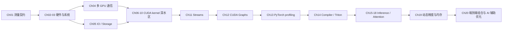

# 各章节优化方法详解（GPU + CPU）

更新时间：2026-07-02  
适用范围：`code/ch01` 到 `code/ch20` 的 benchmark、compare 入口、CPU-only minimal 路径与 GPU/系统优化主题。  
说明：本文按现有章节 README、benchmark 文件名与已接入的 `cpu_minimal` 目标反推各章优化方法。`cpu_minimal` 是统一的 CPU 教学/quickstart 目标，不代表每章 GPU 主题的 CPU 等价实现。

## 目录

- [总体脉络](#总体脉络)
- [统一 CPU-only Minimal 路径](#统一-cpu-only-minimal-路径)
- [章节总览](#章节总览)
- [Chapter 1 - Performance Fundamentals](#chapter-1---performance-fundamentals)
- [Chapter 2 - GPU Hardware Architecture](#chapter-2---gpu-hardware-architecture)
- [Chapter 3 - System Tuning](#chapter-3---system-tuning)
- [Chapter 4 - Distributed Communication & Multi-GPU Distribution](#chapter-4---distributed-communication--multi-gpu-distribution)
- [Chapter 5 - Storage and IO Optimization](#chapter-5---storage-and-io-optimization)
- [Chapter 6 - CUDA Programming Fundamentals](#chapter-6---cuda-programming-fundamentals)
- [Chapter 7 - Memory Access Patterns](#chapter-7---memory-access-patterns)
- [Chapter 8 - Occupancy, Warp Efficiency & ILP](#chapter-8---occupancy-warp-efficiency--ilp)
- [Chapter 9 - Arithmetic Intensity & Kernel Fusion](#chapter-9---arithmetic-intensity--kernel-fusion)
- [Chapter 10 - Tensor Core Pipelines & Cluster Features](#chapter-10---tensor-core-pipelines--cluster-features)
- [Chapter 11 - Streams & Concurrency](#chapter-11---streams--concurrency)
- [Chapter 12 - CUDA Graphs & Dynamic Workloads](#chapter-12---cuda-graphs--dynamic-workloads)
- [Chapter 13 - PyTorch Profiling & Memory Tuning](#chapter-13---pytorch-profiling--memory-tuning)
- [Chapter 14 - Compiler & Triton Optimization](#chapter-14---compiler--triton-optimization)
- [Chapter 15 - Disaggregated Inference & KV Management](#chapter-15---disaggregated-inference--kv-management)
- [Chapter 16 - Production Inference Optimization](#chapter-16---production-inference-optimization)
- [Chapter 17 - Disaggregated Prefill/Decode & Routing](#chapter-17---disaggregated-prefilldecode--routing)
- [Chapter 18 - Advanced Attention & Decoding](#chapter-18---advanced-attention--decoding)
- [Chapter 19 - Dynamic & Adaptive Inference Precision/Memory Systems](#chapter-19---dynamic--adaptive-inference-precisionmemory-systems)
- [Chapter 20 - AI-Assisted Performance Optimization & Case Studies](#chapter-20---ai-assisted-performance-optimization--case-studies)
- [如何验证每章方法有效](#如何验证每章方法有效)

## 总体脉络

这套章节从“怎么可信地测量”开始，逐步下钻到 CUDA kernel、内存访问、Tensor Core、通信、编译器、推理服务和端到端组合优化。每章通常包含两类路径：

- GPU/系统正式路径：面向 CUDA、NCCL、NVSHMEM、Triton、CUTLASS、PyTorch compile、vLLM/serving 等实际优化主题；需要对应硬件和软件能力，unsupported 时应显式 skip/fail。
- CPU/Host 路径：包括统一 `cpu_minimal` quickstart，以及部分章节真实的 CPU/Host 优化主题，例如 NUMA、DataLoader、storage、CPU reduction、host staging、allocator、scheduler 等。



## 统一 CPU-only Minimal 路径

所有章节都接入了 `cpu_minimal`，用于无 GPU 环境下快速体验 baseline/optimized 对比。

| 项目 | 说明 |
| --- | --- |
| Baseline | 纯 Python 三重循环做小矩阵乘加，突出解释器循环和标量执行开销 |
| Optimized | CPU 上的 `torch.addmm`，复用相同输入，走 PyTorch 向量化/BLAS 路径 |
| Correctness | 与 `torch.addmm` reference 比较，检查 shape、finite、tolerance |
| 入口 | `python -m chXX.compare_cpu_minimal`、`python -m chXX.compare`、`python -m cli.aisp bench run --targets chXX:cpu_minimal` |
| 边界 | 它是 CPU quickstart，不是原 GPU target 的降级替身，也不产生 Nsight/CUDA profiling 证据 |

通用验证命令：

```bash
python -m ch02.compare_cpu_minimal
python -m ch02.compare
python -m cli.aisp bench list-targets --chapter ch02
python -m cli.aisp bench run --targets ch02:cpu_minimal --profile minimal
```

## 章节总览

| Chapter | 主线 | GPU 优化关键词 | CPU/Host 优化关键词 |
| --- | --- | --- | --- |
| `ch01` | benchmark 基础与 GEMM 案例 | FP16、融合、batched/strided GEMM、NVFP4 memory tradeoff | `cpu_minimal`、训练 loop goodput、Python overhead |
| `ch02` | GPU 硬件架构 | cuBLAS tuning、NVLink/PCIe、zero-copy、Grace coherency | 硬件扫描、CPU-GPU 拓扑、coherent memory |
| `ch03` | 系统调优 | GEMM、pinned prefetch、双缓冲供给 | NUMA、pageable vs pinned、容器/集群配置、rack prep |
| `ch04` | 多 GPU 通信 | NCCL、NVSHMEM、NVLink、tensor/data/pipeline parallel | CPU reduction、host staging、通信编排 |
| `ch05` | Storage/IO | GDS、distributed IO、GPU pipeline feeding | DataLoader、vectorization、decompression、storage CPU |
| `ch06` | CUDA 基础 | 自定义 kernel、ILP、launch bounds、autotuning、bank conflicts | `cpu_minimal` 对照与 host launch 意识 |
| `ch07` | 内存访问模式 | coalescing、float4、HBM、TMA、async prefetch、shared memory | lookup/layout 分析、CPU quickstart |
| `ch08` | Occupancy/Warp/ILP | occupancy tuning、warp divergence、loop unroll、tcgen05、HBM | `cpu_minimal`、branch/loop 直觉 |
| `ch09` | 算术强度与融合 | CUTLASS、Triton、cuBLASLt、FP4/FP8、micro tiling、fused norm | memory-bound vs compute-bound 分类 |
| `ch10` | Tensor Core pipeline | TMA、warp specialization、persistent kernels、DSMEM、cluster multicast | CPU quickstart、pipeline 概念对照 |
| `ch11` | Streams 并发 | CUDA streams、Hyper-Q、stream ordered KV、multistream warp specialization | adaptive scheduling、CPU 侧同步减少 |
| `ch12` | CUDA Graphs 动态工作负载 | graph replay、conditional graph、dynamic parallelism、GPU work queue | 减少 CPU launch/scheduling 参与 |
| `ch13` | PyTorch profiling/memory | `torch.compile`、FP8/FP4、context/expert/sequence parallel | DataLoader、memory profiling、allocator、KV cache |
| `ch14` | Compiler/Triton | Inductor、Triton persistent、CUTLASS/TMA、FlexAttention、quantized NCCL | graph-break 控制、compile cost 管理 |
| `ch15` | Disaggregated inference/KV | NVLink KV pool、MoE dispatch、allreduce+rmsnorm、spec decode | continuous batching、queueing、placement |
| `ch16` | 生产推理优化 | Flash SDP、block sparse、piece graphs、regional compilation | runtime scheduler、telemetry/load simulation |
| `ch17` | Prefill/Decode 与路由 | prefill/decode disagg、pipeline parallel、MoE routing | dynamic/static routing、TTFT/TPOT 策略 |
| `ch18` | 高级 attention/decoding | FlexAttention、FlexDecoding、paged attention、CUDA graphs、tensor cores | EOS polling/early exit、vLLM loop integration |
| `ch19` | 动态精度/内存 | FP4/FP8/MXFP8/NVFP4、KV prefetch overlap、quantized cache | adaptive allocator、memory double buffering |
| `ch20` | AI 辅助与端到端 | autotuning、BF16/NVFP4 MLP、pipeline、KV cache、training kernels | 组合验证、memory standard、AI kernel workflow |

## Chapter 1 - Performance Fundamentals

### GPU 优化方法

- FP16/tensor-core-friendly 训练 loop：把 FP32 eager training 改为 FP16 或混合精度路径，提升 GEMM/linear 层吞吐。
- Microbatch fusion：把多个小 work item 合并，减少 Python/framework/kernel launch 开销。
- CUDA GEMM launch amortization：从单次/单块 GEMM 过渡到 batched 或 strided GEMM，减少 dispatch overhead，提高 arithmetic intensity。
- NVFP4 MLP memory tradeoff：低精度/压缩权重路径重点展示 memory footprint 下降，不强行把所有优化都解释为 latency speedup。

### CPU/Host 优化方法

- `cpu_minimal`：Python scalar matmul vs `torch.addmm`，演示“相同任务交给底层库”带来的 CPU 可见加速。
- 训练 loop goodput：关注 batch、microbatch、precision、framework overhead，而不仅是单 kernel 时间。

### 典型 targets

| Target | 方法 |
| --- | --- |
| `performance` | FP16 + fusion 组合路径 |
| `performance_fp16` | 只隔离 precision 变化 |
| `performance_fusion` | 只隔离 launch/microbatch fusion 变化 |
| `gemm` | baseline CUDA GEMM vs batched/strided GEMM |
| `nvfp4_mlp` | 低精度 MLP 内存 footprint 优化 |
| `cpu_minimal` | CPU quickstart |

## Chapter 2 - GPU Hardware Architecture

### GPU 优化方法

- cuBLAS tuning：调整 TF32/tensor op math、stream affinity 和调用参数，使 GEMM 更贴合目标 GPU。
- NVLink/PCIe transfer 对比：用 microbench 测量不同 fabric 的带宽/延迟，不靠规格表猜测。
- zero-copy/coherent memory：在 Grace-Blackwell 类平台上比较显式拷贝、共享映射与 coherency 路径。
- Multi-GPU transfer：对比 topology-aware 与 generic transfer，避免错误 GPU placement 放大通信成本。

### CPU/Host 优化方法

- 硬件扫描：记录 GPU、CPU、NUMA、NVLink/NVSwitch、fabric 连接，为后续 benchmark provenance 提供事实。
- CPU-GPU topology-aware 选择：根据 NUMA locality、C2C、PCIe root complex 选择 staging 或 coherency 策略。
- `cpu_minimal`：保证无 CUDA 主机仍可跑最小对比。

### 典型 targets

| Target | 方法 |
| --- | --- |
| `cublas` | cuBLAS/TF32/tensor op tuning |
| `memory_transfer` | host-device transfer 路径对比 |
| `memory_transfer_multigpu` | 多 GPU fabric transfer |
| `grace_coherent_memory` | Grace coherent memory / zero-copy |
| `cpu_minimal` | CPU quickstart |

## Chapter 3 - System Tuning

### GPU 优化方法

- pinned prefetch MLP：用 pinned memory 和 prefetch 减少 host-device 数据供给瓶颈。
- double-buffered batch provisioning：CPU 准备下一批数据的同时 GPU 处理当前批，减少空转。
- GEMM host/runtime 对比：用稳定 GPU workload 量化 host/runtime 调优是否真的让 GPU 更饱和。

### CPU/Host 优化方法

- NUMA pinning：把进程、DataLoader、内存分配绑定到更靠近 GPU 的 NUMA 节点。
- pageable vs pinned copy：比较普通 pageable host memory 与 pinned memory 的 transfer 差异。
- 容器/Kubernetes/rack prep：通过固定 governor、容器设置、调度亲和性减少运行环境噪声。
- `cpu_minimal`：提供无 GPU 的 quickstart。

### 典型 targets

| Target | 方法 |
| --- | --- |
| `pageable_copy` | pageable 到 pinned/更优 transfer 路径 |
| `pinned_prefetch_mlp` | pinned + prefetch 供给模型 |
| `double_buffered_batch_provisioning` | 双缓冲 batch 准备 |
| `rack_prep` | 系统/rack 层准备与配置调优 |
| `gemm` | 用 GPU compute 观察 host 调优影响 |

## Chapter 4 - Distributed Communication & Multi-GPU Distribution

### GPU 优化方法

- NCCL collectives：all-reduce/broadcast 等通信路径的基准与调优。
- communication-compute overlap：用 no-overlap vs overlap 对比通信隐藏效果。
- gradient fusion/compression：把小梯度合并或压缩为 FP16/INT8，降低 collective 次数和字节数。
- NVLink topology-aware：根据 GPU fabric 拓扑安排 tensor/data parallel 或 KV/activation movement。
- NVSHMEM/IBGDA：减少 CPU 参与，让 GPU 侧发起/推进通信，适合低延迟 pipeline 或 device-driven synchronization。
- symmetric memory：跨 GPU 对称地址/内存池，降低多 GPU 状态共享和 sharding 管理复杂度。

### CPU/Host 优化方法

- CPU reduction vs GPU reduction：用 `cpu_reduction` 展示 host 聚合的成本和适用边界。
- host staging/PCIe staging：明确何时 host staging 是瓶颈，何时必须走 GPU fabric。
- communicator lifecycle：`reinit_comm` 类目标展示反复初始化通信器的开销。
- `cpu_minimal`：统一 quickstart。

### 典型 targets

| Target | 方法 |
| --- | --- |
| `no_overlap` | 串行 compute/communication baseline |
| `gradient_fusion` | 梯度合并减少 collective 开销 |
| `gradient_compression_fp16` / `gradient_compression_int8` | 降低通信字节数 |
| `dataparallel` / `tensor_parallel_*` | 数据并行/张量并行通信模式 |
| `nvshmem_*` | GPU-driven communication 与 pipeline |
| `symmetric_memory*` | 对称内存池 |
| `nvlink_topology_aware*` | 拓扑感知 placement |

## Chapter 5 - Storage and IO Optimization

### GPU 优化方法

- GPUDirect Storage：在平台支持时绕开 CPU bounce buffer，直接把 NVMe 数据送入 GPU memory pipeline。
- distributed IO feeding：多 GPU/多进程训练时并行读取和分发数据，避免某个 reader 拖慢全局 step。
- IO/compute overlap：把数据读取、解压、拷贝与 GPU compute pipeline 重叠。

### CPU/Host 优化方法

- DataLoader tuning：调节 workers、prefetch、pinned memory、batching，减少 GPU idle。
- vectorized preprocessing：把 Python 逐样本处理改为批量/向量化处理。
- decompression：优化压缩数据解码路径，避免 CPU 解压成为瓶颈。
- storage CPU path：测量传统 CPU-mediated storage path，作为 GDS/分布式 IO 的对照。

### 典型 targets

| Target | 方法 |
| --- | --- |
| `vectorization` | 预处理向量化 |
| `decompression` | 解压路径优化 |
| `storage_cpu` | CPU storage baseline/对照 |
| `distributed_multigpu` | 多 GPU 分布式读取 |
| `host_staged_reduction` | host staging/reduction 的 IO 代价 |

## Chapter 6 - CUDA Programming Fundamentals

### GPU 优化方法

- custom elementwise/add kernels：从简单 CUDA kernel 建立 thread/block/grid 映射。
- ILP：在单线程内暴露多个独立操作，提高 issue utilization。
- launch bounds：控制 register/occupancy tradeoff，避免资源使用过高导致 resident CTA 下降。
- bank conflict avoidance：调整 shared memory layout，减少 bank conflict stall。
- autotuning/adaptive：对 block size、tile、unroll、launch 参数进行自动搜索。
- quantization ILP / attention ILP：把基础 kernel 方法迁移到低精度和 attention 类 workload。

### CPU/Host 优化方法

- host launch awareness：理解 kernel launch 固定成本，避免把太小工作拆成太多 launch。
- `cpu_minimal`：用 CPU loop 对比库调用，帮助理解“不要在 Python 层做细粒度循环”。

### 典型 targets

| Target | 方法 |
| --- | --- |
| `add` | 第一个 CUDA kernel / elementwise parallelism |
| `elementwise_ilp` | 指令级并行 |
| `launch_bounds` | launch bounds 与 occupancy tradeoff |
| `bank_conflicts` | shared memory bank conflict 优化 |
| `autotuning` | 自动搜索 launch/tile 参数 |
| `warp_divergence_ilp` | divergence 与 ILP 的组合优化 |

## Chapter 7 - Memory Access Patterns

### GPU 优化方法

- coalesced memory access：让 warp 内线程访问连续地址，提高 global memory transaction 效率。
- vectorized loads/stores：`float4` 等向量化访问提高每条指令搬运字节数。
- HBM copy/peak：量化接近 HBM 带宽上限需要的访问模式。
- async prefetch：提前把未来数据搬入 cache/shared memory，隐藏 memory latency。
- TMA bulk tensor copy：用 Blackwell/Hopper 风格的 tensor memory accelerator 搬运 2D tensor tile。
- shared-memory tiling：对 lookup、copy、matmul 类 workload 做 staging 和 reuse。

### CPU/Host 优化方法

- layout 分析：在 CPU 侧理解 row-major/column-major/gather/scatter 对缓存和传输的影响。
- lookup workload 建模：区分随机访问、局部性和 cache thrashing。
- `cpu_minimal`：统一 quickstart。

### 典型 targets

| Target | 方法 |
| --- | --- |
| `memory_access` | scalar/coalesced memory 对比 |
| `float4_vector` | vectorized load/store |
| `hbm_copy` / `hbm_peak` | HBM 带宽路径 |
| `async_prefetch` | 异步预取 |
| `tma_copy` / `tma_bulk_tensor_2d` | TMA 2D tensor copy |
| `lookup` | lookup-heavy access 优化 |

## Chapter 8 - Occupancy, Warp Efficiency & ILP

### GPU 优化方法

- occupancy tuning：调 block size、register 使用、shared memory 使用，提高 resident warps/CTAs。
- warp divergence reduction：用 predication、统一控制流、阈值 kernel 重写降低分支分裂。
- loop unrolling：减少 loop overhead，暴露更多 ILP，但需要控制 register pressure。
- tiling/tcgen05：对 matmul/tensor-core 路径使用更合适的 tile 和 tcgen05 相关路径。
- HBM/vectorized CUDA：把内存带宽 kernel 改为向量化访问。
- AI optimization/NVFP4 MLP：把 occupancy/ILP 思路迁移到模型层 workload。

### CPU/Host 优化方法

- 分支与循环直觉：通过 CPU scalar quickstart 理解 branch/loop overhead，但正式优化仍在 GPU profiler 中验证。
- `cpu_minimal`：统一 quickstart。

### 典型 targets

| Target | 方法 |
| --- | --- |
| `occupancy_tuning` | occupancy-aware launch/block tuning |
| `threshold` / `thresholdtma` | divergence/predication/TMA 变体 |
| `loop_unrolling` | unroll 与 ILP |
| `tiling` / `tiling_tcgen05` | tile/tensor-core 路径 |
| `hbm` / `hbm_cuda` | HBM 带宽优化 |
| `tcgen05_custom_vs_cublas` | 自定义 tcgen05 vs 库实现对比 |

## Chapter 9 - Arithmetic Intensity & Kernel Fusion

### GPU 优化方法

- roofline 思维：区分 memory-bound 与 compute-bound，再决定优化方向。
- kernel fusion：把 L2 norm、activation、reduction 等连续操作融合，减少全局内存往返。
- micro-tiling matmul：在 register/shared memory 中复用 tile，提高 arithmetic intensity。
- CUTLASS/CUTE/cuBLASLt：使用成熟库或 DSL 获取 tensor-core tile、epilogue fusion、FP4/FP8 支持。
- Triton：快速写出可调 tile 的 GPU kernel，和 CUDA/CUTLASS 路径互为对照。
- SDPA/attention：把融合和 tiling 用于 attention 类 workload。

### CPU/Host 优化方法

- compute-bound vs memory-bound 分类也适用于 CPU：先看瓶颈是算力、内存带宽还是 launch/framework overhead。
- `cpu_minimal`：统一 quickstart。

### 典型 targets

| Target | 方法 |
| --- | --- |
| `memory_bound` / `compute_bound` | roofline 分类 |
| `fused_l2norm` | norm/reduction fusion |
| `micro_tiling_matmul` | micro tile 复用 |
| `cutlass_gemm*` / `cublaslt_gemm*` | 库/模板化 tensor-core GEMM |
| `triton` | Triton kernel |
| `sdpa_attention` | attention fusion/tiling |
| `*_fp4` / `*_fp8` | 低精度 tensor-core 路径 |

## Chapter 10 - Tensor Core Pipelines & Cluster Features

### GPU 优化方法

- warp specialization：把 producer、compute、consumer 角色拆到不同 warp/warpgroup，减少流水线阻塞。
- TMA-fed pipeline：用 TMA 搬运 tile，降低显式 staging 开销。
- persistent kernels：让 kernel 驻留并在设备端迭代多个 work item，摊薄 launch/setup 成本。
- double/triple buffering：在 shared memory/tmem 中 ping-pong staging，重叠 load/compute/store。
- thread-block clusters / DSMEM：利用 cluster 与 distributed shared memory 做跨 CTA 协作。
- cluster multicast：一个 tile 多 CTA 共享，减少重复加载。
- FlashAttention/tensor-core attention：把 pipeline 技术用于 attention。

### CPU/Host 优化方法

- pipeline 概念对照：CPU 侧只负责设置任务，关键是减少每 iteration 的 host 参与和 launch 频率。
- `cpu_minimal`：统一 quickstart。

### 典型 targets

| Target | 方法 |
| --- | --- |
| `double_buffered_pipeline` / `pipeline_3stage` | 多阶段流水线 |
| `tma_2d_pipeline` | TMA tensor tile staging |
| `persistent_matmul_tma` / `cooperative_persistent` | persistent kernel |
| `tcgen05_warp_specialization*` | warp/warpgroup specialization |
| `cluster_group*` / `dsmem_reduction` | thread-block cluster / DSMEM |
| `cluster_multicast` | TMA multicast |
| `flash_attention` / `flash_attn_tma_micro_pipeline` | attention pipeline |

## Chapter 11 - Streams & Concurrency

### GPU 优化方法

- CUDA streams overlap：把 copy、compute、communication 分到不同 stream，重叠独立工作。
- stream ordering：用 event/ordered allocator 保持依赖正确，同时避免全局同步。
- KV-cache stream ordered update：对 cache 更新使用精确顺序依赖，避免粗暴 serialize。
- Hyper-Q/multistream GEMM：让硬件同时接收多个 work queue，减少空闲。
- warp-specialized multistream：结合 stream 并发与 warp specialization。
- adaptive streams：根据 runtime telemetry 调整 stream 数量和调度策略。

### CPU/Host 优化方法

- 减少 host synchronization：用事件和 stream 依赖替代 `cudaDeviceSynchronize` 式全局等待。
- adaptive scheduling：CPU runtime 根据观测到的 latency/queue depth 调整提交节奏。
- `cpu_minimal`：统一 quickstart。

### 典型 targets

| Target | 方法 |
| --- | --- |
| `streams` / `gemm_streams` | 多 stream 重叠 |
| `stream_ordered` / `stream_ordered_kv_cache` | 精确依赖与 cache 更新 |
| `tensor_cores_streams` | tensor core work 的 stream 并发 |
| `adaptive_streams` | 动态 stream 策略 |
| `distributed_streams` | 分布式/通信并发 |
| `warp_specialized_multistream*` | warp specialization + multistream |

## Chapter 12 - CUDA Graphs & Dynamic Workloads

### GPU 优化方法

- CUDA Graph capture/replay：稳定 workload 捕获成 graph，重复 replay 降低 CPU launch overhead。
- conditional graphs：用条件节点支持有限动态分支，避免完全回退到 eager launch。
- graph memory tuning：复用 graph memory pool，降低 allocation overhead。
- dynamic parallelism：设备端发起子 kernel，减少 CPU 调度参与。
- GPU work queue：把不均匀任务放到 GPU-resident queue，由 GPU workers 拉取。
- kernel fusion：减少 graph 内节点数和 memory round trip。

### CPU/Host 优化方法

- 减少 CPU launch/scheduling：把 steady-state 执行从 Python/host loop 转移到 graph replay 或 device queue。
- uneven partition 对照：比较静态 partition 与 work queue 对 tail latency/负载不均的影响。
- `cpu_minimal`：统一 quickstart。

### 典型 targets

| Target | 方法 |
| --- | --- |
| `cuda_graphs` | graph capture/replay |
| `cuda_graphs_conditional*` / `graph_conditional_runtime` | 条件 graph |
| `kernel_launches` | launch overhead baseline |
| `dynamic_parallelism_host` / `dynamic_parallelism_device` | host vs device launch |
| `work_queue` | GPU-resident queue |
| `uneven_static` / `uneven_partition` | 不均匀负载调度 |
| `kernel_fusion` | graph 内 fusion |

## Chapter 13 - PyTorch Profiling & Memory Tuning

### GPU 优化方法

- `torch.compile` / regional compile：减少 PyTorch eager overhead，但控制 graph break 和 compile cost。
- FP8/FP4 quantization：使用 Transformer Engine、torchao 或静态/分通道量化降低 memory/compute 成本。
- attention variants：standard、sliding window、long context attention 对比 cache/memory/compute 取舍。
- context/expert/sequence parallel：多 GPU 维度拆分长上下文、专家和序列。
- warp specialization training：把低层 kernel 技术用于 training path。

### CPU/Host 优化方法

- profiler-driven workflow：先用 PyTorch profiler/memory profiler 找 DataLoader、autograd、allocator、KV cache 等热点。
- DataLoader tuning：减少数据加载拖慢 GPU。
- memory profiling/allocator：降低 fragmentation 和不必要 allocation。
- KV cache naive vs optimized：减少 cache 管理 overhead。
- `cpu_minimal`：统一 quickstart。

### 典型 targets

| Target | 方法 |
| --- | --- |
| `training_standard` / `training_speed` | training loop 优化 |
| `autograd_standard` | autograd overhead 基线 |
| `dataloader_default` | DataLoader 调优基线 |
| `memory_profiling` | memory profiler / allocator 调优 |
| `precisionfp8*` / `fp8_perchannel` / `fp4_perchannel` | 低精度训练/推理 |
| `regional_compile` | 局部编译 |
| `context_parallel_multigpu` / `expert_parallel_multigpu` / `sequence_parallel_multigpu` | 多 GPU parallelism |

## Chapter 14 - Compiler & Triton Optimization

### GPU 优化方法

- `torch.compile` / Inductor：对稳定图做 fusion、layout planning、kernel generation。
- graph break control：改写控制流与 Python side effect，让编译器看到更大连续图。
- Triton persistent kernels：让 tile loop 驻留，减少 launch 和 global memory traffic。
- regional Triton/compilation：只编译收益明显的子图，降低 compile overhead。
- CUTLASS vs cuBLAS：用于观察库实现、模板化 kernel 与手写/生成路径的差异。
- FlexAttention sparse/sliding window：编译器友好的稀疏 attention 表达。
- NCCL quantization：通信前量化/压缩，减少带宽压力。

### CPU/Host 优化方法

- compile cost 管理：CPU 侧编译时间、cache、warmup 与 steady-state 分离记录。
- graph-break 修复：很多优化不是改 CUDA，而是移除 Python 动态行为。
- `cpu_minimal`：统一 quickstart。

### 典型 targets

| Target | 方法 |
| --- | --- |
| `model_compile_reduced_precision` | compile + reduced precision |
| `graph_break_control_flow` | 控制流 graph break 修复 |
| `triton_persistent` | persistent Triton kernel |
| `regional_triton` | 区域 Triton/compile |
| `flex_attention_sparse` / `sliding_window` | sparse/window attention 编译路径 |
| `nccl_quantization` | quantized communication |
| `cublas_vs_cutlass` | 库实现对比 |

## Chapter 15 - Disaggregated Inference & KV Management

### GPU 优化方法

- prefill/decode disaggregation：把 prefill 与 decode 放到不同资源池，减少相互阻塞。
- NVLink KV pool：跨 GPU HBM 池化 KV cache，利用高带宽 fabric。
- continuous batching：动态合批，提高 decode throughput。
- MoE dispatch/routing：优化 expert 分发、通信和 local route overlap。
- allreduce + RMSNorm fusion：把通信和归一化/后处理融合或贴近执行。
- speculative decoding：用 draft/verify 以额外 compute 换低延迟。

### CPU/Host 优化方法

- queueing/scheduler：CPU serving runtime 管理请求排队、batch assembly、placement。
- greedy sampler fast path：避免不必要概率 tensor 和后处理。
- inference placement：根据 GPU/KV locality/fabric 选择请求落点。
- `cpu_minimal`：统一 quickstart。

### 典型 targets

| Target | 方法 |
| --- | --- |
| `inference_monolithic` | 单体 serving baseline |
| `prefill_decode_disagg*` | prefill/decode 分离 |
| `kv_cache_management` / `kv_cache_nvlink_pool*` | KV cache 管理/池化 |
| `continuous_batching*` | 连续合批 |
| `moe_*` / `wide_ep` | MoE serving / expert parallel |
| `greedy_sampler` / `guided_decoding` / `speculative_decoding` | decode policy 优化 |
| `allreduce_rmsnorm` | 通信+计算融合 |

## Chapter 16 - Production Inference Optimization

### GPU 优化方法

- Flash SDP / dense attention flash：用 fused scaled-dot-product attention 降低 memory traffic。
- block-sparse attention：利用稀疏模式减少无效 attention 计算。
- piece graphs：把服务端稳定片段 graph 化，降低 launch overhead，同时保留动态外壳。
- regional compilation：对稳定子路径编译，避免全模型 compile cost 过高。
- FP8/NVFP4 serving：在满足精度验证时降低 memory bandwidth 和 compute 成本。

### CPU/Host 优化方法

- runtime scheduler：根据请求长度、batch、cache 状态做调度。
- telemetry hooks：把 latency、throughput、cache、GPU util 接入负载测试与回归验证。
- production load simulation：用合成/真实请求形态验证 TTFT/TPOT/tail latency。
- `cpu_minimal`：统一 quickstart。

### 典型 targets

| Target | 方法 |
| --- | --- |
| `flash_sdp` / `dense_attention_flash` | Flash attention/SDP |
| `flashinfer_block_sparse` | block-sparse backend |
| `piece_graphs` | piecewise CUDA Graph |
| `regional_compilation` | serving 子图编译 |
| `runtime_scheduler` | runtime 调度 |
| `nvfp4_mlp` | low-precision inference block |

## Chapter 17 - Disaggregated Prefill/Decode & Routing

### GPU 优化方法

- disaggregated prefill/decode：围绕 TTFT 与 TPOT 分离资源池。
- batched/overlap multigpu handoff：跨 GPU 的 prefill/decode handoff 与 overlap。
- pipeline parallelism：长上下文/多阶段推理拆成 pipeline。
- MoE router local capacity/topology-aware：让 routing 考虑 expert locality、capacity 和 fabric。
- inference full：把 routing、memory、pipeline 组合为完整推理 workload。

### CPU/Host 优化方法

- dynamic routing：根据 telemetry 动态选择 prefill/decode/expert/pipeline 路径。
- static routing：作为对照，衡量动态策略是否真的值得复杂度。
- memory management：请求路由时把 KV locality 和 cache pressure 纳入调度。
- `cpu_minimal`：统一 quickstart。

### 典型 targets

| Target | 方法 |
| --- | --- |
| `prefill_decode_disagg*` | 分离式 prefill/decode 与多 GPU 变体 |
| `dynamic_routing` / `routing_static` | 动态 vs 静态 routing |
| `moe_router_local_capacity` | MoE local capacity routing |
| `pipeline_parallelism` | pipeline serving |
| `memory` | serving memory/KV 管理 |
| `inference_full` | 完整组合路径 |

## Chapter 18 - Advanced Attention & Decoding

### GPU 优化方法

- FlexAttention/FlexDecoding：用可组合 attention mask/score mod/decode kernel 快速表达新 attention。
- paged attention backend/layout：优化 KV block layout，减少 cache miss 与搬运。
- RoPE Q cache：缓存/query 侧旋转位置编码相关中间结果。
- CUDA graph bucketing：按 shape/batch bucket 捕获 decode graph，兼顾动态请求和 replay。
- tensor-core/tiny GEMM fused：对小 GEMM/attention 子操作做 fusion 和 tensor-core 化。
- vLLM decode graphs / v1 integration：把 kernel 优化接入 serving engine loop。

### CPU/Host 优化方法

- EOS early exit：CPU/runtime 及时发现 batch 已结束，减少无效 decode。
- EOS sync polling 优化：减少轮询同步成本，避免 CPU-GPU sync 过密。
- serving loop integration：runtime bucket、graph replay、KV layout 要和 vLLM loop 协同。
- `cpu_minimal`：统一 quickstart。

### 典型 targets

| Target | 方法 |
| --- | --- |
| `flexattention_sliding_window` | sliding-window FlexAttention |
| `flexdecoding` | FlexDecoding decode path |
| `paged_attn_backend` / `paged_attn_layout` | paged attention backend/layout |
| `rope_q_cache` | RoPE/Q cache |
| `cudagraph_bucketing` / `vllm_decode_graphs` | decode graph replay |
| `eos_early_exit` / `eos_sync_polling` | decode 结束检测与同步优化 |
| `tiny_gemm_fused` / `tensor_cores` | 小 GEMM fusion/tensor core |

## Chapter 19 - Dynamic & Adaptive Inference Precision/Memory Systems

### GPU 优化方法

- dynamic precision：按 token/layer/phase 切换精度，控制误差与吞吐。
- dynamic quantized cache：KV cache 动态量化，降低 HBM footprint 和 bandwidth。
- coalesced quantized cache refresh：把相同 bitwidth/format 的刷新合并，提高 memory efficiency。
- FP4/FP6/FP8/MXFP8/NVFP4：低精度训练/推理与硬件 kernel 对比。
- KV prefetch overlap：预取下一段 KV cache，同时执行当前 compute。
- memory double buffering：双缓冲减少读写等待。
- vectorization memory：用向量化访问和 layout 调整提高 memory throughput。

### CPU/Host 优化方法

- adaptive allocator：监控 memory pool/fragmentation，根据压力调整分配策略。
- adaptive parallelism：根据 runtime 状态选择并行度或 worker pool 策略。
- calibration/validation：低精度路径必须有数值校验，不能只看 latency。
- `cpu_minimal`：统一 quickstart。

### 典型 targets

| Target | 方法 |
| --- | --- |
| `dynamic_precision` | 动态精度切换 |
| `dynamic_quantized_cache*` | 动态量化 KV cache |
| `fp4_hardware_kernel` / `fp4_weight_quantization` | FP4 硬件/权重量化 |
| `mxfp8_moe` / `nvfp4_training` | MXFP8/NVFP4 训练或 MoE |
| `kv_prefetch_overlap` | KV 预取重叠 |
| `memory_double_buffering` | 内存双缓冲 |
| `adaptive_parallelism` | 自适应并行策略 |

## Chapter 20 - AI-Assisted Performance Optimization & Case Studies

### GPU 优化方法

- autotuning：自动搜索 kernel/block/tile/precision 参数，并用 harness 验证收益。
- BF16/NVFP4 MLP：对比标准精度和低精度 MLP block，验证性能与数值。
- end-to-end bandwidth：把单点内存优化放进完整 pipeline，观察是否仍然有效。
- integrated KV cache：把 paged/block-wise cache 管理接入端到端推理。
- pipeline sequential vs optimized：比较串行阶段执行与 staged pipeline。
- training single：单设备训练案例与 CUDA kernel 验证。
- AI kernel generator/workflow：用 AI 生成或辅助探索 kernel，再通过 verification tool 验证。

### CPU/Host 优化方法

- 组合验证：CPU/runtime 层负责把 memory、pipeline、KV、training 子系统组织进同一个 end-to-end workload。
- memory standard：用系统级 memory benchmark 验证 allocator/layout 改动。
- proof/verification workflow：AI 生成代码不能直接信任，需要 correctness、性能、provenance 三重证据。
- `cpu_minimal`：统一 quickstart。

### 典型 targets

| Target | 方法 |
| --- | --- |
| `autotuning` | 自动调参 |
| `bf16_mlp` / `nvfp4_mlp` | 精度策略与 MLP block |
| `end_to_end_bandwidth` | 端到端带宽 case study |
| `integrated_kv_cache` | 集成 KV cache |
| `pipeline_sequential` | pipeline 串行/优化对比 |
| `memory_standard` | 系统 memory path |
| `training_single` | 单设备训练案例 |
| `moe` | MoE 端到端优化 |

## 如何验证每章方法有效

### CPU-only 验证

```bash
python -m chXX.compare_cpu_minimal
python -m chXX.compare
python -m cli.aisp bench run --targets chXX:cpu_minimal --profile minimal
```

通过标准：退出码为 0，输出 `target=cpu_minimal`、`device=cpu`，baseline/optimized correctness 校验通过，并显示大于 1 的 speedup。

### GPU 正式验证

```bash
python -m cli.aisp bench list-targets --chapter chXX
python -m cli.aisp bench run --targets chXX --profile minimal --single-gpu
python -m cli.aisp bench run --targets chXX:<target> --profile deep_dive --single-gpu
```

通过标准：

- GPU clocks、硬件能力、driver/toolkit、profiling 状态写入 artifact/provenance。
- unsupported capability 显式 `SKIPPED:` 或 fail-fast，不用 CPU 结果冒充 GPU target。
- baseline/optimized 输出等价，verification payload 通过。
- speedup、latency、throughput、memory、profiler evidence 能解释“为什么快”。

### 消融验证建议

| 消融点 | 预期观察 | 目的 |
| --- | --- | --- |
| 关闭 fusion | launch 数和 memory traffic 上升 | 证明 fusion 的收益不是随机噪声 |
| 关闭 overlap | GPU idle 或 communication wait 增加 | 证明 stream/NCCL overlap 有效 |
| 改回 pageable memory | H2D/D2H transfer 变慢 | 证明 pinned/prefetch 的价值 |
| 改回 eager launch | CPU launch overhead 增加 | 证明 CUDA Graph/persistent kernel 的价值 |
| 关闭 quantization | memory footprint/bandwidth 上升 | 证明 FP8/FP4/NVFP4 降低数据移动 |
| 关闭 topology-aware routing | fabric traffic 或 tail latency 恶化 | 证明 placement/routing 的价值 |
| 取消 correctness check | 可能出现“快但错”的假优化 | 证明 benchmark 必须先验证正确性 |

### 阅读顺序建议

1. 先跑 `ch01` 和任意章节的 `cpu_minimal`，理解 benchmark 合约。
2. 再读 `ch02`、`ch03`，掌握硬件与系统背景。
3. 按需深入 `ch06`-`ch10` 的 CUDA kernel 技术。
4. 做 serving/LLM 时重点读 `ch15`-`ch19`。
5. 最后用 `ch20` 检查多个优化组合后是否仍然成立。
