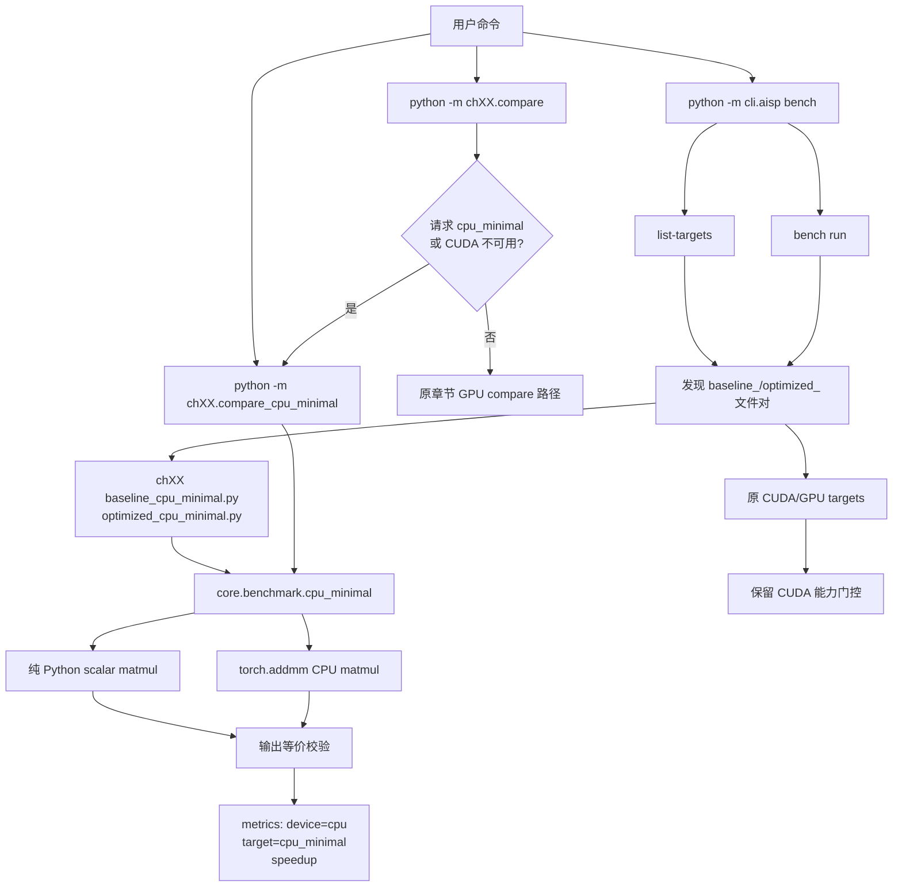
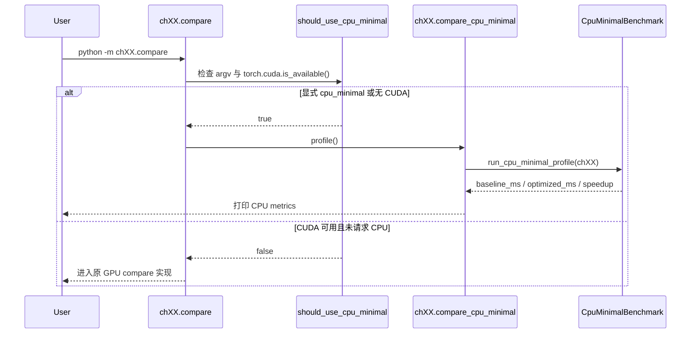
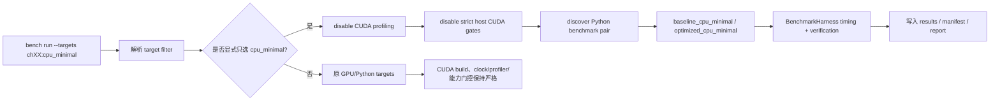
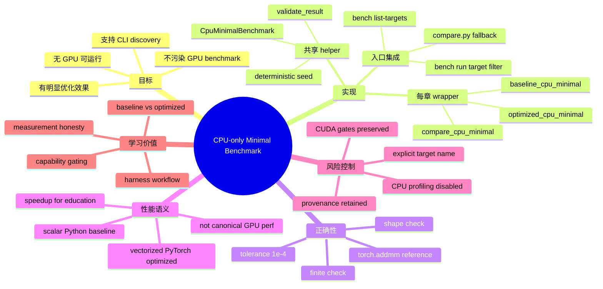

# CPU-only Minimal Benchmark 设计文档

更新时间：2026-07-02  
适用范围：`code/ch02` 到 `code/ch20` 的 CPU-only 最小可运行 benchmark 路径，以及它与 `compare.py`、`cli.aisp bench`、benchmark harness 的集成方式。

## 目录

- [一句话结论](#一句话结论)
- [反推设计](#反推设计)
- [架构图](#架构图)
- [关键决策依据](#关键决策依据)
- [有效性验证](#有效性验证)
- [消融实验](#消融实验)
- [关键词科普](#关键词科普)
- [知识地图](#知识地图)
- [痛点、误解与局限](#痛点误解与局限)
- [费曼学习法解析](#费曼学习法解析)
- [顶尖实践者的共通底层思路](#顶尖实践者的共通底层思路)
- [内行最大分歧](#内行最大分歧)
- [理解力测试题](#理解力测试题)

## 一句话结论

把每章新增为显式的 `cpu_minimal` 目标，而不是把 CPU 结果伪装成原来的 CUDA/GPU 目标；它用同一份 CPU benchmark helper 生成“慢的纯 Python baseline”和“快的 `torch.addmm` optimized”，既能在无 GPU 主机上产生可见加速效果，又不会污染原 GPU benchmark 的能力门槛与性能语义。

## 反推设计

### 用户可见契约

目标是让下面三类入口在 CPU-only 环境下都有可运行、可观察、可验证的最小路径：

| 入口 | 期望行为 | CPU-only 设计结果 |
| --- | --- | --- |
| `python -m chXX.compare` | 交互式快速对比 | 无 CUDA 或显式请求 `cpu_minimal` 时转入 `chXX.compare_cpu_minimal` |
| `python -m cli.aisp bench list-targets --chapter chXX` | 列出章节目标 | 出现 `chXX:cpu_minimal`，并保留原 GPU 目标 |
| `python -m cli.aisp bench run --targets chXX:cpu_minimal --profile minimal` | CLI benchmark smoke | 只跑 CPU 目标，关闭 CUDA/Nsight profiling 与 GPU host gates |

关键语义：`cpu_minimal` 是一个新的、显式命名的目标。它不是 `gemm`、`cublas`、`nvfp4_mlp` 等 GPU 目标的替身。

### 实现拆解

| 层次 | 文件/模块 | 职责 |
| --- | --- | --- |
| 共享 benchmark | `code/core/benchmark/cpu_minimal.py` | 定义 `CpuMinimalBenchmark`，统一数据生成、baseline、optimized、校验、计时输出 |
| 每章 thin wrapper | `code/ch02` 至 `code/ch20` 的 `baseline_cpu_minimal.py`、`optimized_cpu_minimal.py` | 保持仓库发现约定：baseline/optimized 文件对 + `get_benchmark()` |
| 每章交互入口 | `code/ch02` 至 `code/ch20` 的 `compare_cpu_minimal.py`、`compare.py` | `compare_cpu_minimal` 打印 CPU 对比；`compare.py` 在无 CUDA 时 fallback 到 CPU quickstart |
| CLI 目标发现 | `code/core/benchmark/bench_commands.py` | `list-targets` 能发现 `cpu_minimal`，同时不隐藏原 GPU targets |
| Harness 执行 | `code/core/harness/run_benchmarks.py` | 对显式 CPU-only 目标跳过 CUDA build/profiling/gates；对 GPU 目标继续严格能力门控 |

### Benchmark 语义

同一份输入矩阵和权重在 CPU 上执行两种实现：

| 角色 | 实现 | 为什么有效 |
| --- | --- | --- |
| Baseline | 三重 Python loop 计算小矩阵乘加 | 故意暴露解释器循环开销，慢但容易读懂 |
| Optimized | `torch.addmm(self.bias, self.x, self.weight.t(), out=self.result)` | 调用 PyTorch CPU 向量化/底层 BLAS 路径，快且仍可在 CPU 上运行 |
| Correctness | 与 `torch.addmm` reference 比较，容忍度 `1e-4` | 确保“快”不是因为少算或算错 |

`CpuMinimalBenchmark` 还设置了：

- `allow_cpu = True`：声明该目标允许 CPU 执行。
- `cpu_fallback_benchmark = True`：让 harness 能识别这是 CPU-only quickstart 目标。
- `signature_equivalence_group = "cpu_minimal"`：baseline/optimized 属于同一签名等价组。
- `enable_profiling = False`：CPU quickstart 不伪造 CUDA/Nsight profile 证据。

## 架构图

### 总体结构

### `compare.py` quickstart 流程

### CLI benchmark 流程

## 关键决策依据

| 决策 | 选择 | 决策依据 | 如果反过来做的风险 |
| --- | --- | --- | --- |
| CPU 路径命名 | 新目标 `cpu_minimal` | 明确告诉用户这是 CPU 教学/quickstart 目标 | 把 CPU 数字塞进 `gemm`/`cublas` 会污染 GPU benchmark 语义 |
| 实现复用 | 共享 `core/benchmark/cpu_minimal.py` | 19 个章节逻辑一致，集中校验和维护 | 每章复制一份会产生漂移，后续修 bug 成本高 |
| 章节接入 | 保留 `baseline_*.py`/`optimized_*.py` wrapper | 匹配现有 benchmark discovery 约定 | 新增一套发现机制会扩大改动面 |
| baseline | 纯 Python 三重循环 | 效果明显、可读、纯 CPU、无需依赖编译器 | 若 baseline 也用 `torch.mm`，新手看不到优化差异 |
| optimized | `torch.addmm` | CPU 上有真实向量化/库调用路径，结果可校验 | 手写“优化”容易复杂且不稳定 |
| 正确性 | 与 reference 做 tolerance 校验 | 性能数字必须先证明等价 | 只看耗时会鼓励“少算所以快”的错误优化 |
| CLI profile | CPU 目标关闭 CUDA/Nsight profiling | CPU quickstart 不能伪装成 GPU profile 证据 | `--profile minimal` 可能误导为已经生成 Nsight GPU 证据 |
| GPU 目标 | 保留 fail-fast/skip | 符合能力门控：unsupported 不能降级冒充 supported | 静默 CPU fallback 会让 benchmark 数据不可审计 |

## 有效性验证

### 验证目标

| 维度 | 验证方式 | 通过标准 |
| --- | --- | --- |
| 可运行性 | `python -m chXX.compare_cpu_minimal` 遍历 `ch02`-`ch20` | 每章退出码为 0 |
| 可见效果 | baseline/optimized speedup | 每章都有明显大于 1 的 speedup |
| fallback 体验 | `python -m ch02.compare` | CPU-only host 上输出 `target=cpu_minimal`、`device=cpu` |
| CLI 发现 | `bench list-targets --chapter ch02` | 输出包含 `ch02:cpu_minimal` 且保留 GPU targets |
| CLI 执行 | `bench run --targets ch02:cpu_minimal --profile minimal` | `Succeeded: 1 | Failed: 0`，且显示 CPU-only 目标关闭 CUDA profiling |
| 正确性 | `validate_result()` 与 verification payload | 输出 shape 正确、finite、`max_diff <= 1e-4` |

### 已执行命令与结果

环境观察：本次验证在 CPU-only PyTorch 环境中执行，`python -m ch02.compare` 输出 `pytorch_version='2.12.1+cpu'`、`device='cpu'`。

| 命令 | 结果摘要 |
| --- | --- |
| `python - <<'PY' ... for ch02..ch20: python -m chXX.compare_cpu_minimal ... PY` | 19/19 章节退出码为 0 |
| `python -m ch02.compare` | 输出 `target='cpu_minimal'`、`device='cpu'`、speedup 约 `243.29x` |
| `python -m cli.aisp bench list-targets --chapter ch02` | 输出包含 `ch02:cpu_minimal`、`ch02:cublas`、`ch02:grace_coherent_memory` 等 |
| `python -m cli.aisp bench run --targets ch02:cpu_minimal --profile minimal --iterations 2 --warmup 1` | `Benchmarks: 1 | Succeeded: 1 | Failed: 0`，CLI 明确记录 `profile_type: none`、`enable_profiling: false` |

逐章 quickstart 效果如下：

| Chapter | 结果 |
| --- | --- |
| `ch02` | pass，speedup `247.44x` |
| `ch03` | pass，speedup `253.86x` |
| `ch04` | pass，speedup `252.58x` |
| `ch05` | pass，speedup `197.17x` |
| `ch06` | pass，speedup `256.23x` |
| `ch07` | pass，speedup `242.36x` |
| `ch08` | pass，speedup `246.88x` |
| `ch09` | pass，speedup `250.13x` |
| `ch10` | pass，speedup `248.09x` |
| `ch11` | pass，speedup `253.67x` |
| `ch12` | pass，speedup `243.69x` |
| `ch13` | pass，speedup `237.52x` |
| `ch14` | pass，speedup `247.36x` |
| `ch15` | pass，speedup `211.84x` |
| `ch16` | pass，speedup `251.46x` |
| `ch17` | pass，speedup `250.28x` |
| `ch18` | pass，speedup `229.35x` |
| `ch19` | pass，speedup `231.10x` |
| `ch20` | pass，speedup `245.64x` |

注意：CLI harness 的 speedup 与 `compare_cpu_minimal` 的 speedup 可能不同，因为 CLI 走完整 harness、不同 warmup/iteration、验证与统计开销不同；有效性判断看“可运行、结果等价、显式 CPU 目标、成功完成”，不是把 quickstart 数字当作正式性能结论。

## 消融实验

### 已验证消融

| 实验 | 操作 | 观察 | 结论 |
| --- | --- | --- | --- |
| 章节覆盖 | 跑 `ch02`-`ch20` 的 `compare_cpu_minimal` | 19/19 pass | wrapper 模式可以批量复用 |
| 交互 fallback | 跑 `python -m ch02.compare` | 无 CUDA 时进入 `cpu_minimal` | 新手 quickstart 不再被 CUDA availability 卡住 |
| CLI 显式目标 | 跑 `ch02:cpu_minimal` | 单目标成功，GPU profiling disabled | CPU 目标可以被 harness 独立执行 |

### 建议保留的设计消融

这些消融不一定需要每次都跑，但适合作为后续评审或回归测试的 checklist：

| 被移除/替换的设计 | 预期退化 | 用来证明什么 |
| --- | --- | --- |
| 移除 `cpu_minimal` 显式命名，把 CPU 结果挂到 GPU target | 用户会误读 CPU 数字，结果污染 expectation/provenance | 命名隔离是 benchmark 诚实性的核心 |
| 每章复制完整 CPU benchmark，不用共享 helper | 章节间 shape、tolerance、metadata 漂移 | 共享 helper 降低维护风险 |
| baseline 改成 `torch.mm` | speedup 接近 1 或噪声主导 | baseline 必须体现一个真实低效点 |
| optimized 改成另一个 Python loop | 加速效果不稳定或不明显 | optimized 应使用真实库/向量化路径 |
| 取消 `validate_result()` | 错误实现也可能通过 timing | benchmark 必须先正确再谈性能 |
| CPU 目标继续打开 CUDA/Nsight profiling | CPU-only host 出错或生成误导性 profile 状态 | profile 证据要匹配目标能力 |
| `compare.py` 不做 CPU fallback | 无 GPU 用户第一步失败 | quickstart 需要低门槛入口 |
| CLI 对所有目标都无条件 CPU fallback | GPU 目标 unsupported 状态消失 | 能力门控必须保留 fail-fast/skip 语义 |

## 关键词科普

| 关键词 | 简明解释 | 在本设计中的含义 |
| --- | --- | --- |
| Benchmark | 用固定任务测量实现差异 | 小矩阵乘加在 baseline/optimized 之间对比 |
| Baseline | 参考实现，不一定最快 | 纯 Python scalar loop，慢但清晰 |
| Optimized | 优化实现 | `torch.addmm` CPU 路径 |
| Target | CLI 可选择的 benchmark 名称 | `chXX:cpu_minimal` 是独立目标 |
| Capability gating | 能力不足时显式跳过/失败 | GPU targets 无 CUDA 时仍不能伪装成功 |
| Fallback | 入口层面的替代体验 | 仅 `compare.py` quickstart 在无 CUDA 时转 CPU；GPU target 本身不 fallback |
| Harness | benchmark 运行、验证、记录框架 | `bench run` 负责 discovery、timing、report、manifest |
| Verification payload | 用于证明 baseline/optimized 语义等价的数据 | 输入、输出、batch size、parameter count、precision flags、tolerance |
| Provenance | 解释结果来源的元数据 | target、profile、git、hardware、iterations、timestamp 等 |
| Ablation | 去掉一个设计点看退化 | 用来证明“为什么必须这么设计” |
| Profile | 性能剖析配置 | CPU quickstart 的 `--profile minimal` 不代表生成 Nsight GPU 证据 |

## 知识地图

## 痛点、误解与局限

### 解决的痛点

| 痛点 | 设计如何解决 |
| --- | --- |
| 没有 GPU 无法开始学习 | `compare.py` 和 `cpu_minimal` 提供 CPU-only 第一跳 |
| CLI 教程命令不可跑 | `bench list-targets` 与 `bench run chXX:cpu_minimal` 可在 CPU host 上完成 |
| 想看到“优化有效”但不能编译 CUDA | Python loop vs `torch.addmm` 能稳定显示明显 speedup |
| 不想破坏原 GPU benchmark 严格性 | CPU target 显式命名，GPU targets 仍按硬件能力 skip/fail |
| 多章重复改造成本高 | 共享 helper + thin wrapper 让 ch02-ch20 模式一致 |

### 容易误解处

| 误解 | 正确理解 |
| --- | --- |
| `cpu_minimal` 是每章原优化主题的 CPU 等价实现 | 不是；它是统一 quickstart/教学目标 |
| `--profile minimal` 跑 CPU target 会生成 Nsight 证据 | 不会；CPU target 内部关闭 CUDA profiling |
| speedup 很大说明章节 GPU 优化也有同样收益 | 不能这么推断；这是 Python loop vs 库调用的教育性对比 |
| fallback 代表 GPU target 会自动降级到 CPU | 不代表；只有 quickstart 入口选择 CPU target，GPU benchmark 合约仍严格 |
| baseline 慢是作弊 | baseline 慢是为了展示“把 Python 循环交给底层库”的真实优化方向，但它不是正式 GPU 性能基线 |

### 代价与局限

| 项目 | 说明 |
| --- | --- |
| 代表性有限 | 它不覆盖 Tensor Core、CUDA memory hierarchy、Nsight profiling、GPU clocks 等章节核心硬件议题 |
| 数字不可外推 | CPU quickstart speedup 不能用于判断 GPU kernel 优劣 |
| 章节差异被弱化 | ch02-ch20 的 CPU target 共用同一算子，不体现每章独特优化主题 |
| harness 语义更复杂 | 同时存在 CPU quickstart 与 GPU canonical target，需要文档讲清边界 |
| 仍依赖 PyTorch | 是 CPU-only，但不是零依赖；需要安装 `torch` |

## 费曼学习法解析

### 用小学生也能懂的话讲

我们让每一章都有一个“纸笔算法”和一个“计算器算法”。纸笔算法就是 Python 一格一格算矩阵乘法；计算器算法就是让 PyTorch 一次性帮我们算。两者算的是同一道题，所以要先检查答案一样。答案一样后，再比较谁快。因为这个实验只用 CPU，所以没有显卡的人也能看到“优化为什么会有用”。

### 类比

| 类比 | 对应设计 |
| --- | --- |
| 手工逐个加账本 vs 用 Excel 公式 | Python loop vs `torch.addmm` |
| 新手练车场 vs 正式赛道 | `cpu_minimal` vs GPU benchmark |
| 食品标签 | `target=cpu_minimal` 告诉用户“这是 CPU quickstart，不是 GPU 成绩” |
| 安检门 | capability gating 防止不具备 CUDA 条件的任务假装通过 |

### 第一性原理推导

1. benchmark 的本质是比较两个实现的同一任务。
2. 比较之前必须证明任务相同、输出等价。
3. 性能数字必须附带环境和目标语义，否则无法解释。
4. 无 GPU 用户需要一个能完成闭环的学习路径。
5. 但 unsupported GPU benchmark 不能被 CPU 结果替代，否则 benchmark 合约失真。
6. 因此最小设计是：新增显式 CPU target，保留原 GPU target 严格能力门控，用共享 helper 保证跨章节一致性。

## 顶尖实践者的共通底层思路

| 底层思路 | 表现 |
| --- | --- |
| 先保真，再优化 | 输出等价、能力门控、provenance 比 speedup 更基础 |
| 命名就是合约 | `cpu_minimal` 这个名字防止用户把 quickstart 当 canonical GPU 结果 |
| 隔离变量 | baseline 与 optimized 共享输入、shape、seed、校验，只改变实现方式 |
| 让失败可解释 | CUDA 不可用时 GPU target 应该 skip/fail，而不是静默降级 |
| 低门槛不等于低标准 | quickstart 可以简单，但仍要有 correctness check 和结构化输出 |
| 维护成本是设计变量 | 19 章统一 helper 优于 19 份近似复制 |
| 测量是产品界面 | CLI 输出、manifest、report 都是用户理解系统的证据链 |

## 内行最大分歧

### 分歧一：CPU fallback 应不应该存在？

| 立场 | 最强论据 | 最担心的问题 |
| --- | --- | --- |
| 应该存在 | 教学项目需要无 GPU onboarding；CI、文档 smoke、读者本地电脑都能跑通闭环 | 如果命名不清，会让 CPU 数字冒充 GPU benchmark |
| 不应该存在 | 性能工程应尽早暴露真实硬件要求；GPU 章节在 CPU 上跑会削弱能力门控 | 新手第一步失败，无法体验 harness 和验证流程 |

本设计的折中：保留 CPU quickstart，但必须显式命名为 `cpu_minimal`；GPU targets 不静默降级。

### 分歧二：用统一 toy benchmark，还是每章写专属 CPU 类比？

| 立场 | 最强论据 | 最担心的问题 |
| --- | --- | --- |
| 统一 toy benchmark | 一致、稳定、易维护，适合 ch02-ch20 批量 quickstart | 不能表达每章专属概念，例如 stream、graph、quantization、memory hierarchy |
| 每章专属 CPU 类比 | 教学贴合章节主题，更能解释原优化思想 | 维护量大，容易写出不等价或误导的 CPU analogy |

本设计的折中：先提供统一最小闭环；如后续要做高质量教学，再为少数章节增加明确命名的专属 CPU demos，而不是覆盖 `cpu_minimal`。

### 分歧三：明显 speedup 是否会误导？

| 立场 | 最强论据 | 最担心的问题 |
| --- | --- | --- |
| 明显 speedup 有价值 | 新手能直观看到“把循环交给库”的效果，快速建立优化反馈感 | 用户把 `200x` 理解成 GPU 优化收益 |
| 应更代表真实 workload | benchmark 应尽量贴近生产，避免 toy number | 代表性越强，依赖和运行成本越高，CPU-only 目标可能不再 minimal |

本设计的折中：文档和输出强调这是 CPU quickstart，不是正式性能结论；正式 GPU benchmark 仍需要目标硬件、profiling 和 clocks。

## 理解力测试题

### 题目

1. 为什么不能把 `cpu_minimal` 的结果记录到原来的 `gemm` 或 `cublas` target 名下？
2. `python -m ch02.compare` 在无 CUDA 时可以跑 CPU，为什么 `python -m cli.aisp bench run --targets ch02:cublas` 不应该自动跑 CPU？
3. 如果 optimized 实现比 baseline 快很多，但 `validate_result()` 失败，应该如何解释这个结果？
4. 为什么每章只放 thin wrapper，而不是每章复制完整 CPU benchmark 类？
5. `--profile minimal` 跑 `ch02:cpu_minimal` 时看到 `profile_type: none`，这是 bug 吗？为什么？
6. 如果把 baseline 从 Python loop 改成 `torch.addmm`，这个 benchmark 的教学价值会发生什么变化？
7. 设计一个能证明 `cpu_minimal` 没有污染 GPU targets 的检查。
8. 为什么 `signature_equivalence_group = "cpu_minimal"` 比完全不声明等价组更好？
9. 如果某章未来要做“CPU 版章节专属教学 demo”，应该复用 `cpu_minimal` 名称吗？为什么？
10. 看到 quickstart speedup `250x`，能否说该章节的 CUDA 优化预计也有 `250x`？请给出理由。

### 参考答案与评分要点

| 题号 | 真正吃透的答案要点 | 死记答案的常见特征 |
| --- | --- | --- |
| 1 | target 名称是性能语义合约；CPU quickstart 与 GPU benchmark 的硬件、profile、目标不同，混记会污染 provenance 和 expectations | 只说“名字不一样” |
| 2 | `compare.py` 是交互 quickstart；CLI GPU target 是正式目标选择，必须保留 capability gating | 泛泛说“CLI 更严格” |
| 3 | 性能无效；优化必须先满足输出等价，否则可能是少算/错算 | 只看 speedup 大小 |
| 4 | 共享 helper 保证一致性、降低维护、避免章节漂移；wrapper 保持 discovery 约定 | 只说“省代码” |
| 5 | 不是 bug；CPU target 不应生成 CUDA/Nsight 证据，`minimal` 这里只是 CLI profile 输入，实际目标降级为 no profiling | 误以为所有 profile 都必须启用 Nsight |
| 6 | speedup 会接近噪声，失去“解释器循环 vs 库调用”的教学对比 | 只说“会更快”或“会更慢” |
| 7 | 跑 `list-targets` 确认目标分离；无 CUDA 跑 `ch02:cublas` 应 skip/fail，跑 `ch02:cpu_minimal` 成功；检查 report target 字段 | 只跑 `compare.py` |
| 8 | 让验证系统知道 baseline/optimized 可比较，字段差异规则显式，减少误配 | 只说“为了验证” |
| 9 | 不应复用；应另起明确名称，避免把通用 quickstart 与章节专属语义混在一起 | 认为所有 CPU demo 都叫 `cpu_minimal` |
| 10 | 不能；CPU quickstart 测的是 Python loop 到 CPU 库调用的差异，不代表 GPU kernel、memory、Tensor Core 或 profiler 结果 | 直接外推 speedup |

### 实战加试

给定一个新 chapter `ch21`，请写出最小接入 checklist：

1. 新增 `baseline_cpu_minimal.py`，`get_benchmark()` 返回 `get_cpu_minimal_benchmark("ch21", vectorized=False)`。
2. 新增 `optimized_cpu_minimal.py`，`get_benchmark()` 返回 `get_cpu_minimal_benchmark("ch21", vectorized=True)`。
3. 新增 `compare_cpu_minimal.py`，调用 `run_cpu_minimal_profile("ch21")` 并打印结果。
4. 在 `compare.py` 入口使用 `should_use_cpu_minimal()`，无 CUDA 或请求 CPU 时转入 `compare_cpu_minimal`。
5. 验证 `python -m ch21.compare_cpu_minimal`、`python -m ch21.compare`、`python -m cli.aisp bench list-targets --chapter ch21`、`python -m cli.aisp bench run --targets ch21:cpu_minimal --profile minimal`。
6. 确认原 GPU targets 仍在无 CUDA 时显式 skip/fail，而不是被 CPU target 替代。
